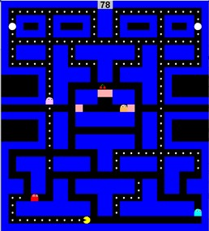

# 1.1 Pacman Game Clone Overview

**Overview written by Peter Mitchell.**

## Contents

```
1.1 Pacman Game Clone Overview
1.2 Introduction
1.3 The Rules of Pacman
1.4 High Level Discussion About Implementation
1.5 Features You Could Add
```
# 1.2 Introduction

This document will explain the fundamentals of how the Pacman game works. 

# 1.3 The Rules of Pacman

The rules of Pacman can be summarised briefly as the following.

- Play is done on a map consisting of walls preventing movement, dots to eat for score, large
    powerups to eat to frighten ghosts, points to teleport from one side of the map to the other.
- The player plays as Pacman and can move up/down/left/right using the arrow keys within the
    confines of the map.
- There are four ghosts. Red, Cyan, Pink, Orange. Each ghost has their own AI to make them
    behave in different ways using Chase, Scatter, and Frightened states.
- The red ghost is active right away, the pink ghost starts after eating the first dot, the cyan
    starts after eating 30 dots, and orange starts after eating 30% of the dots.
- Cherries worth 150 points appear to be eaten in the middle at 70 dots eaten and 170 dots
    eaten.
- While in a frightened state, if Pacman collides with a ghost, it will be eaten giving 100 bonus
    score and return the ghost to their start position in the middle.
- Pacman colliding with a ghost while it is not frightened will result in an automatic game over.
- The game is won when all the dots have been eaten.


# 1.4 High Level Discussion About Implementation



Due to the nature of how much content is in this game only a few parts will be briefly discussed instead
of giving a rundown of every class and their behaviours. The following two links provide information
that was used in designing the AI.

```
A) https://gameinternals.com/understanding-pac-man-ghost-behavior
B) https://dev.to/code2bits/pac-man-patterns--ghost-movement-strategy-pattern-1k1a
```
Link A goes into a lot of detail discussing how each ghost should behave. The logic described in that
page heavily influenced how the code was written to implement the strategies of the AI. The second
link B discusses the AI class pattern used in developing the game. The pattern allows separation of
behaviour from the generic Ghost. This allows for easy swapping between different types of
behaviours. Particularly if there was a desire to add additional behaviours later.

The following classes provided the most generic utility:

- ActionTimer: Used to handle timers for changes between states in the AI, and for delays
    between movements.
- Position: Used extensively to represent both coordinates and direction vectors.

The following classes represent objects on the map:

- CherryObject: Represents the cherries that appear at 70 and 170 dots collected. Added to the
    map using a ‘C’.
- CollectableObject: Represents the dots. Added to the map using a ‘.’.
- DoorObject: Keeps the middle blocked off to the player so that ghosts can exit the middle.
    Added to the map using a ‘D’.
- MapObject: The generic map object inherited by all other map objects, which is also used to
    create the empty map objects with a ‘ ‘.
- PowerupObject: Represents the object that when eaten will frighten ghosts. Added to the
    map using a ‘*’.
- TeleportObject: Represents an object that can teleport Pacman from one side to the other of
    the map. Can be added to the map using a ‘T’.
- WallObject: Represents a generic obstacle. Can be added to the map using a ‘W’.


The following objects are special map objects that can move.

- Pacman: The player character that can be moved with arrow keys. Can be added to the map
    using ‘P’.
- Ghost: The ghost that can be any of the coloured ghosts that use behaviours to control
    movement.

The following classes are used to define parts of the map:

- Map: manages an array of MapObjects in addition to Pacman and Ghost objects.

The following classes are used to define where and how a Ghost can move:

- AINode: Represents data based on MapObjects to pre-cache all the positions that can be
    moved to, and to get valid moves based on conditions passed to it.
- GhostAI: Stores an array of AINodes to match the MapObjects array in Map. Along with a lot
    of helper methods to be used by the AI for all AI behaviours.

The following classes are used to define the behaviours for Ghosts:

- ChaseAggressive: Used by Red. Chases as directly as possible to Pacman.
- ChaseAmbush: Used by Pink. Chases to a position 4 units in front of Pacman.
- ChasePatrol: Used by Cyan. Chases a position found by getting the direction vector from red
    to a position two in front of Pacman’s current facing and then doubling the distance.
- ChaseRandom: Used by Orange. If Pacman is far (>8 units away) it will use ChaseAggressive,
    otherwise it will fall back to ScatterBottomLeftCorner.
- FrightenedWandering: Used by all Ghosts to try and run away from Pacman by choosing the
    worst path to get to Pacman.
- ScatterBottomLeftCorner: Used by Orange. Moves to loop around the corner.
- ScatterBottomRightCorner: Used by Cyan. Moves to loop around the corner.
- ScatterTopLeftCorner: Used by Pink. Moves to loop around the corner.
- ScatterTopRightCorner: Used by Red. Moves to loop around the corner.

# 1.5 Features You Could Add

The following are some of the things you could work on to improve about the game or add as
additional features.

- Improve the interface to look better.
- Improve the walls to change them to the normal lines instead of blocks of colour.
- Add a high score feature so that you can see the high score and when a new one is achieved
    it is stored.
- Add additional levels. There is already a way to load in maps from files. You can extend it to
    continue between multiple levels.
- Try writing the logic for AI Navigation using A* instead of the dirty method of distance to
    target. This will fix glitches where the AI can move into corners and become stuck (hence the
    extra doors in the middle of the map).
- Create additional types of objects that change the state of the game.
- Modify the teleporters to work for ghosts as well.
- Create additional custom behaviours for the ghosts.
- Create a new rule or behaviour for how the game is played from your own ideas!


